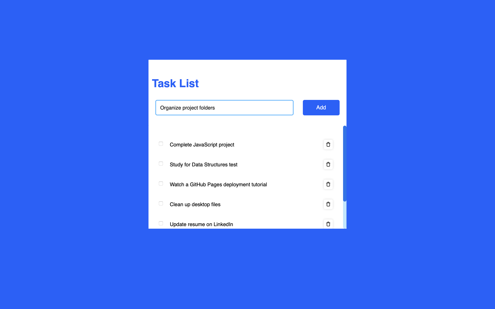

# 📝 Task List

A simple and responsive task list web application built using **HTML**, **CSS**, and **JavaScript**. Users can add, complete, and delete tasks in a clean and interactive UI. This project is ideal for beginners to practice DOM manipulation and JavaScript event handling.

---

## 🔍 Features

* Add new tasks
* Mark tasks as completed
* Delete tasks
* Keyboard support (press Enter to add)
* Responsive and clean layout
* Uses icons from [Unicons](https://iconscout.com/unicons) and [Ionicons](https://ionic.io/ionicons)

---

## 💠 Tech Stack

* HTML5
* CSS3
* JavaScript (Vanilla)
* Unicons
* Ionicons

---

## 🚀 Getting Started

To run the project locally:

1. **Clone the repository**

   ```bash
   git clone https://github.com/RajathPatilKulkarni/task-list.git
   ```

2. **Open the project**

   * Open `index.html` in your browser
   * Or use the **Live Server** extension in VS Code for live preview

---

## 📂 Project Structure

```
task-list/
├── index.html
├── style.css
└── script.js
```

---

## 🏷️ Topics

html • css • javascript • todo-list • task-manager • vanilla-js • web-app • responsive-design

---

## 📸 Screenshot



---

## 📄 License

This project is licensed under the [MIT License](LICENSE).
